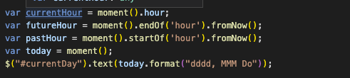

# YourPersonalDayPlanner

The client was looking for a personalized Day Planner that updated the current hour with color coordinated blocks. It also needs to have the ability to be updated and locked with that information.

This part of the planning was most challenging:

## Built With

- [HTML](https://developer.mozilla.org/en-US/docs/Web/HTML)
- [CSS](https://developer.mozilla.org/en-US/docs/Web/CSS)
- [Javascript](https://developer.mozilla.org/en-US/docs/Web/JavaScript)

## Deployed Link

- [See Live Site](https://github.com/JessGiannini/YourPersonalDayPlanner)

## Authors

- **Jessica Giannini**

* [Link to Portfolio Site](https://jessgiannini.github.io/WebDeveloperPortfolio/)
* [Link to Github](https://github.com/jessgiannini)
* [Link to LinkedIn](https://www.linkedin.com/in/jessica-aletta-giannini-155b1310/)

## Acknowledgments

- Thank you to my amazing classmates who help me navigate the ins and outs of coding.
- Thanks to all the YouTube stars who helped me see the many ways to pet a cat.
- Thanks to my friend Kelsey for inspiring me to take this course.
